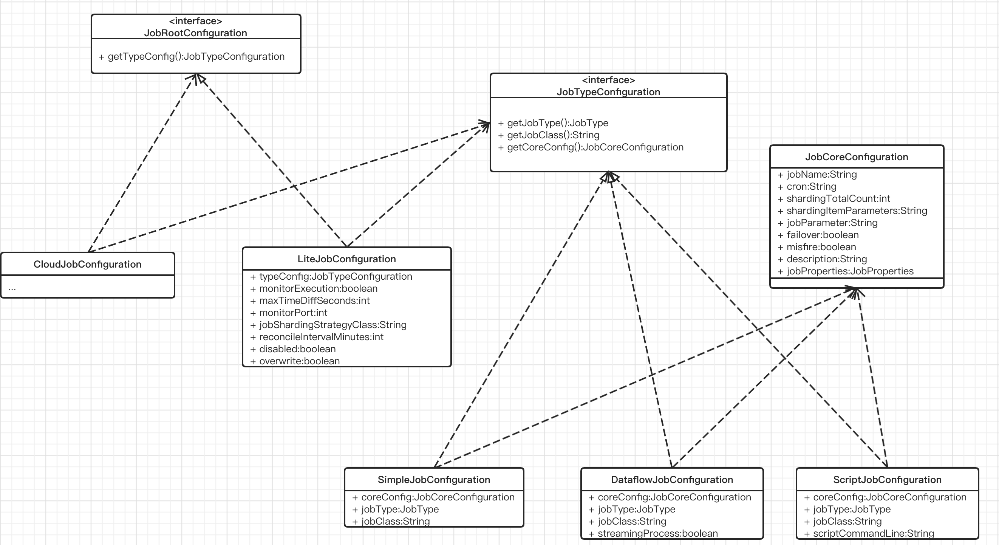
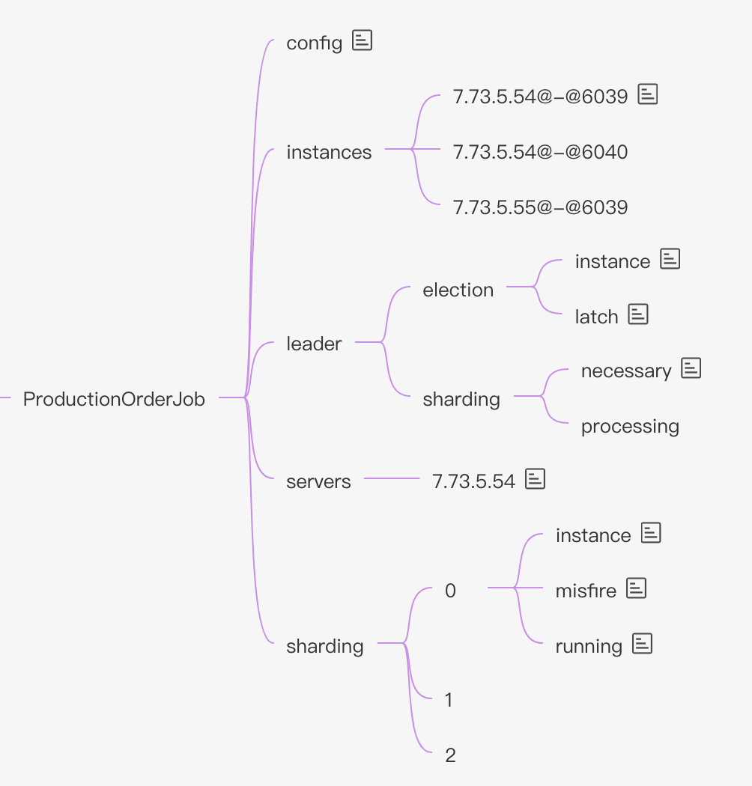

## 概念及特点

**概念**

**Elastic-Job：**是一个分布式调度解决方案，由两个相互独立的子项目Elastic-Job-Lite和Elastic-Job-Cloud组成。
**Elastic-Job-Lite：**定位为轻量级无中心化解决方案，使用jar包的形式提供分布式任务的协调服务。
**Elastic-Job-Cloud：**使用Mesos + Docker的解决方案，额外提供资源治理、应用分发以及进程隔离等服务，采用中心化调度实现难度小于Elastic-Job-Lite的无中心化调度，无需再考虑多线程并发的情况。

**特点**
**Elastic-Job-Lite：**分布式调度协调、弹性扩容缩容、失效转移、错过执行作业重触发、作业分片一致性，保证同一分片在分布式环境中仅一个执行实例、*自诊断并修复分布式不稳定造成的问题*、支持并行调度、支持作业生命周期操作、丰富的作业类型、Spring整合以及命名空间提供、运维平台
**Elastic-Job-Cloud：**在Elastic-Job-Lite支持的特性上增加了：应用自动分发、*基于Fenzo的弹性资源分配*、基于Docker的进程隔离(TBD)


## 三种作业类型

Elastic-Job提供三种作业执行器：

| 作业       | 作业接口    | 执行器              |
| ---------- | ----------- | ------------------- |
| 简单作业   | SimpleJob   | SimpleJobExecutor   |
| 数据流作业 | DataflowJob | DataflowJobExecutor |
| 脚本作业   | ScriptJob   | ScriptJobExecutor   |

* SimpleJob：simpleJob和我们平常所写的job基本无太多区别

* DataflowJob：通常用于不间歇性的数据处理任务。由于作业需要重新分片，所以不适合继续流式数据处理。特定在于不断的加载数据，并且不断处理数据，直到数据为空 或者 作业不适合继续运行。思路参照了TbSchedule设计方式。**如果采用流式作业处理方式，建议processData处理数据后更新其状态，避免fetchData再次抓取到，从而使得作业永不停止。**当作业配置不设置流式处理数据(`DataflowJobConfiguration.streamingProcess = false`) 时，调用 `oneOffExecute()`方法一次加载数据，一次处理数据。

* ScripJob：Script类型作业意为脚本类型作业，支持shell，python，perl等所有类型脚本。代码中配置scriptCommandLine参数指定所要执行的脚本，无需编码。Job的信息会以JSON 格式的数据作为参数传递。ScripJob是什么？说明白点，就是定时执行你的脚本。


## 弹性分布式实现

- 第一台服务器上线触发主服务器选举。主服务器一旦下线，则重新触发选举，选举过程中阻塞，只有主服务器选举完成，才会执行其他任务。
- 某作业服务器上线时会自动将服务器信息注册到注册中心，下线时会自动更新服务器状态。
- 主节点选举，服务器上下线，分片总数变更均更新重新分片标记。
- 定时任务触发时，如需重新分片，则通过主服务器分片，分片过程中阻塞，分片结束后才可执行任务。如分片过程中主服务器下线，则先选举主服务器，再分片。
- 通过上一项说明可知，为了维持作业运行时的稳定性，运行过程中只会标记分片状态，不会重新分片。分片仅可能发生在下次任务触发前。
- 每次分片都会按服务器IP排序，保证分片结果不会产生较大波动。
- 实现失效转移功能，在某台服务器执行完毕后主动抓取未分配的分片，并且在某台服务器下线后主动寻找可用的服务器执行任务。





## 注册中心数据结构

注册中心在定义的命名空间下，创建作业名称节点，用于区分不同作业，所以作业一旦创建则不能修改作业名称，如果修改名称将视为新的作业。作业名称节点下又包含4个数据子节点，分别是config, instances, sharding, servers和leader。




### config节点

作业配置信息，以JSON格式存储

```json
{
  	// 下面是 JobCoreConfiguration 的配置
		"jobName":"javaSimpleJob",
		"jobClass":"com.dangdang.ddframe.job.example.job.simple.JavaSimpleJob",
		"jobType":"SIMPLE",
		"cron":"0/5 * * * * ?",
		"shardingTotalCount":3,
		"shardingItemParameters":"0=Beijing,1=Shanghai,2=Guangzhou",
		"jobParameter":"",
		"failover":false,
		"misfire":true,
		"description":"",
		"jobProperties":{
				"jobexceptionhandler":"com.dangdang.ddframe.job.executor.handler.impl.DefaultJobExceptionHandler",
				"executorservicehandler":"com.dangdang.ddframe.job.executor.handler.impl.DefaultExecutorServiceHandler"
		},
  
  	// 下面这些是 LiteJobConfiguration 配置
		"monitorExecution":true,
		"maxTimeDiffSeconds":-1,
		"monitorPort":-1,
		"jobShardingStrategyClass":"",
		"reconcileIntervalMinutes":10,
		"disabled":false,
		"overwrite":false
}
```

说明：

* JobCoreConfiguration配置：

```java
public final class JobCoreConfiguration {

    /** 作业名称 */
    private final String jobName;
    /** cron表达式，用于控制作业触发时间 */
    private final String cron;
    /** 该作业的分片总数，根据不同的分片策略 JobShardingStrategy 和 机器数量, 每台机器上创建对应的数量的job实例（线程）定时执行任务 */
    private final int shardingTotalCount;
    /** 分片序列号和参数用等号分隔，多个键值对用逗号分隔，分片序列号从0开始，不可大于或等于作业分片总数 如：0=a,1=b,2=c */
    private final String shardingItemParameters;
    /** 作业自定义参数，可通过传递该参数为作业调度的业务方法传参，用于实现带参数的作业，例：每次获取的数据量、作业实例从数据库读取的主键等 */
    private final String jobParameter;
    /** 是否开启任务执行失效转移，开启表示如果作业在一次任务执行中途宕机，允许将该次未完成的任务在另一作业节点上补偿执行 */
    private final boolean failover;
    /**
     * 是否开启错过任务重新执行，默认为：true，
     *
     * 比如，定时任务是5秒，一个任务执行时间是6秒，当 misfire = true 时：
     * 分片索引: 0 | 执行时间: 21:33:00 - 21:33:06 | 线程: 27 | 任务类型: SIMPLE  记录错过了一次
     * 分片索引: 0 | 执行时间: 21:33:06 - 21:33:12 | 线程: 27 | 任务类型: SIMPLE  立即执行
     * 分片索引: 0 | 执行时间: 21:33:15 - 21:33:21 | 线程: 27 | 任务类型: SIMPLE  记录错过了一次
     * 分片索引: 0 | 执行时间: 21:33:21 - 21:33:27 | 线程: 27 | 任务类型: SIMPLE  立即执行
     * 分片索引: 0 | 执行时间: 21:33:30 - 21:33:36 | 线程: 27 | 任务类型: SIMPLE  记录错过了一次
     * 分片索引: 0 | 执行时间: 21:33:36 - 21:33:42 | 线程: 27 | 任务类型: SIMPLE  立即执行
     * 分片索引: 0 | 执行时间: 21:33:45 - 21:33:51 | 线程: 27 | 任务类型: SIMPLE  记录错过了一次
     * 分片索引: 0 | 执行时间: 21:33:51 - 21:33:57 | 线程: 27 | 任务类型: SIMPLE  立即执行
     * 分片索引: 0 | 执行时间: 21:34:00 - 21:34:06 | 线程: 27 | 任务类型: SIMPLE  记录错过了一次
     * 分片索引: 0 | 执行时间: 21:34:06 - 21:34:12 | 线程: 27 | 任务类型: SIMPLE  立即执行
     * ...
     *
     *
     * 比如，定时任务是5秒，一个任务执行时间是6秒，当 misfire = false 时：
     * 分片索引: 0 | 执行时间: 21:42:05 - 21:42:11 | 线程: 27 | 任务类型: SIMPLE
     * 分片索引: 0 | 执行时间: 21:42:15 - 21:42:21 | 线程: 27 | 任务类型: SIMPLE
     * 分片索引: 0 | 执行时间: 21:42:25 - 21:42:31 | 线程: 27 | 任务类型: SIMPLE
     * 分片索引: 0 | 执行时间: 21:42:35 - 21:42:41 | 线程: 27 | 任务类型: SIMPLE
     * 分片索引: 0 | 执行时间: 21:42:45 - 21:42:51 | 线程: 27 | 任务类型: SIMPLE
     *
     */
    private final boolean misfire;
    /** 作业描述 */
    private final String description;
    /**
     * 配置jobProperties定义的枚举控制Elastic-Job的实现细节
     * JOB_EXCEPTION_HANDLER用于扩展异常处理类：比如可以设置该枚举对应的异常处理实现类，默认的实现类是打印一行error日志
     * EXECUTOR_SERVICE_HANDLER用于扩展作业处理线程池类：比如可以设置该枚举对应的线程池服务
     */
    private final JobProperties jobProperties;
    
    ...
}
```

* LiteJobConfiguration配置：

```java
public final class LiteJobConfiguration implements JobRootConfiguration {
    /** 监控作业运行时状态
     每次作业执行时间和间隔时间均非常短的情况，建议不监控作业运行时状态以提升效率。因为是瞬时状态，所以无必要监控。请用户自行增加数据堆积监控。并且不能保证数据重复选取，应在作业中实现幂等性。
     每次作业执行时间和间隔时间均较长的情况，建议监控作业运行时状态，可保证数据不会重复选取。 */
    private final boolean monitorExecution;
    /** 设置最大容忍的本机与注册中心的时间误差秒数，默认-1，不检查. 作业执行前，都会检查下执行环境，这里就检查了本机与注册中心的时间误差秒数是否在允许范围 */
    private final int maxTimeDiffSeconds;
    /** 设置作业辅助监控端口. */
    private final int monitorPort;
    /** 设置作业分片策略实现类全路径 */
    private final String jobShardingStrategyClass;
    /** 修复作业服务器不一致状态服务调度间隔时间，配置为小于1的任意值表示不执行修复，单位：分钟，默认10分钟 */
    private final int reconcileIntervalMinutes;
    /** 作业是否禁止启动，可用于部署作业时，先禁止启动，部署结束后统一启动，默认false */
    private final boolean disabled;
    /** 本地配置是否可覆盖注册中心配置，如果可覆盖，每次启动作业都以本地配置为准，默认false，例如：如果为false，则作业配置以第一次服务启动为准，后续更改不会更新zk上的作业配置 */
    private final boolean overwrite;
 
  	...
}
```

### instances节点

作业运行实例信息，子节点名称是由作业运行服务器的IP地址和PID构成。子节点均为临时节点，当作业实例上线时注册一个节点，下线时自动删除节点。注册中心监控这些节点的变化来协调分布式作业的分片以及高可用。 可在作业运行实例节点写入TRIGGER表示该实例立即执行一次。另外，由于一台机器上可以执行多个分片，所以可以运行多个Job实例，所以可能出现相关IP不同PID的情况，例如：

* 7.73.5.54@-@6039
* 7.73.5.54@-@6040
* 7.73.5.55@-@6039


### sharding节点

作业分片信息，子节点名是分片项的序号，从零开始，分片项序号的子节点存储详细信息。每个分片项下的子节点用于控制和记录分片运行状态。节点详细信息说明：

| 子节点名 | 临时节点 | 描述                                                         |
| :------- | :------- | :----------------------------------------------------------- |
| instance | 否       | 执行该分片项的作业运行实例主键                               |
| running  | 是       | 分片项正在运行的状态 仅配置monitorExecution时有效            |
| failover | 是       | 如果该分片项被失效转移分配给其他作业服务器，则此节点值记录执行此分片的作业服务器IP |
| misfire  | 否       | 是否开启错过任务重新执行                                     |
| disabled | 否       | 是否禁用此分片项                                             |

### servers节点

作业服务器信息，子节点是作业服务器的IP地址。可在IP地址节点写入DISABLED表示该服务器禁用。 在新的cloud native架构下，servers节点大幅弱化，仅包含控制服务器是否可以禁用这一功能。为了更加纯粹的实现job核心，servers功能未来可能删除，控制服务器是否禁用的能力应该下放至自动化部署系统。

### leader节点

作业服务器主节点信息，分为election，sharding和failover三个子节点。分别用于主节点选举，分片和失效转移处理。

leader节点是内部使用的节点，如果对作业框架原理不感兴趣，可不关注此节点。

| 子节点名              | 临时节点 | 描述                                                         |
| :-------------------- | :------- | :----------------------------------------------------------- |
| election\instance     | 是       | 主节点服务器IP地址，一旦该节点被删除将会触发重新选举，重新选举的过程中一切主节点相关的操作都将阻塞 |
| election\latch        | 否       | 主节点选举的分布式锁 为curator的分布式锁使用                 |
| sharding\necessary    | 否       | 是否需要重新分片的标记 如果分片总数变化，或作业服务器节点上下线或启用/禁用，以及主节点选举，会触发设置重分片标记 作业在下次执行时使用主节点重新分片，且中间不会被打断 作业执行时不会触发分片 |
| sharding\processing   | 是       | 主节点在分片时持有的节点 如果有此节点，所有的作业执行都将阻塞，直至分片结束 主节点分片结束或主节点崩溃会删除此临时节点 |
| failover\items\分片项 | 否       | 一旦有作业崩溃，则会向此节点记录 当有空闲作业服务器时，会从此节点抓取需失效转移的作业项 |
| failover\items\latch  | 否       | 分配失效转移分片项时占用的分布式锁 为curator的分布式锁使用   |


## Elastic-job的分片策略
JobShardingStrategy：

 * AverageAllocationJobShardingStrategy：基于平均分配算法的分片策略
 * OdevitySortByNameJobShardingStrategy：根据作业名的哈希值奇偶数决定IP升降序算法的分片策略
 * RotateServerByNameJobShardingStrategy：根据作业名的哈希值对服务器列表进行轮转的分片策略

默认是分配策略是什么，如何实现自定义分片？


如何添加自定义的 ElasticJobListener 


# Elastic-job控制台

elastic-job控制台源码在 elastic-job-lite-console 模块

* 启动入口：ConsoleBootstrap.class
* 启动完成后访问：http://localhost:8899

控制台配置的zk保存地址：~/.elastic-job-console/Configurations.xml
对应的配置类：RegistryCenterConfiguration.java
Configurations.xml示例文件如下：

```xml
<?xml version="1.0" encoding="UTF-8" standalone="yes"?>
<globalConfiguration>
    <registryCenterConfigurations>
        <registryCenterConfiguration name="localhost-5181" zkAddressList="localhost:5181" namespace="elastic-job-example-lite-spring" digest="" activated="true"/>
        <registryCenterConfiguration name="whz-localhost-5181" zkAddressList="localhost:5181" namespace="whz-localhost-5181" digest="whz" activated="false"/>
    </registryCenterConfigurations>
</globalConfiguration>
```

## 控制台使用说明 

* 失效(disable/enable)：不删除作业，将作业挂起，可以随时恢复
* 终止(shutdown)：

* 触发(trigger)：

  * 原理: 点击触发会在"/${namespase}/${jobName}/instances/"下是所有子节点设置一个"TRIGGER"的值，当该节点作业的实例拥有分片时，就会触发该实例立即执行一次，注意，并不是所有"/${namespase}/${jobName}/instances/"节点下作业实例都会触发执行一次，而是相应节点被分配到分片时才触发执行。

    

## 源码-http接口

* 配置相关的Controller类

  * 注册中心配置相关: RegistryCenterRestfulApi

  * 作业配置相关: LiteJobConfigRestfulApi

  * 事件追踪数据源配置: EventTraceDataSourceRestfulApi

* 控制调度任务相关的Controller类
  * Job相关接口: JobOperationRestfulApi
  * 事件追踪历史记录相关接口: EventTraceHistoryRestfulApi
  * 服务器维度相关接口: ServerOperationRestfulApi


